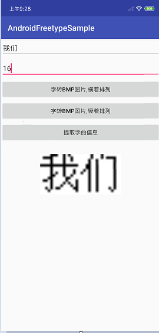

在根目录的build.gradle中添加依赖
```java
allprojects {
   repositories {
       maven { url 'https://jitpack.io' }
   }
}
```

在项目中的build.gradle添加依赖
```java
dependencies {
  implementation 'com.github.tianheng812:AndroidFreetype:2.1'
}
```


初始化

```java
WordManager.getInstance().init(this）;//默认是宋体

WordManager.getInstance().init(this,字体路径);//更改字体
```

销毁

```
 WordManager.getInstance().destroy();
```

1.使用freetype提取字的模式，并可以转化为bmp图，如图

```java
byte[] bytes = WordManager.getInstance().stringToBmpByte("我们", 16, 0);
Bitmap bitmap = BitmapFactory.decodeByteArray(bytes, 0, bytes.length);

```




2.提取点阵：

```java
 StringBuilder builder = new StringBuilder();   
 byte[][] arr = WordManager.getInstance().stringToLattice(content, fontSize, 0);
 for (int i = 0; i < arr.length; i++) {
      for (int j = 0; j < arr[0].length; j++) {
           if (arr[i][j] == 1) {
                 builder.append("1");
             } else {
                  builder.append("0");
             }
       }
            builder.append("\n");
  }

 Log.i("点阵", builder.toString());
```


